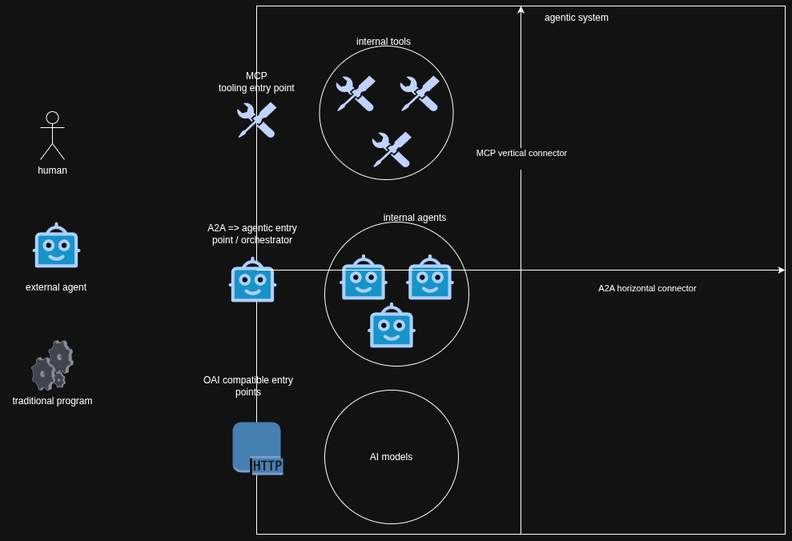

# session 2 of building The Joy in the open

## persistence as a pre requisite for everything

To achieve my ambitious project of an agentic OS that will help me self sustain in this chaotic World (The Joy), I will need:
- money
- a persistence layer

So I'm focusing in this sesison on provisioning a Postgres database on my bare metal server for a currently _secret_ (hush hush) financial assets manager application project.

Installing Postgres on a Ubuntu 24 machine boils down to:

```bash
sudo apt install postgresql postgresql-contrib
# verify the installation
sudo systemctl status postgresql
# make sure it's started on boot
sudo systemctl enable postgresql
sudo -u postgres createuser --superuser $USER
# seamless login will work out of the box if you do that
sudo -u postgres createdb $USER
# test connection, you can quit the invite with `\q`
psql
```

... now any Python program running `psycopg` can connect with the following URL: `postgresql:///my_ubuntu_user`

## parsing unstructured data

I have created the database schema in Postgres for my financial assets manager application project.

Now I need to be able to parse any unstructured piece of data (Markdown files, screenshots, etc.) to do data entry in my application. I'll use plain Langchain chains to do that: no need to get too fancy with graphs at this stage. The endgame will be to wire this to discoverable MCP tools, as our broarder agentic system implies...



... but before even reaching that point, I need to create CRUD methods for each of the tables I have created in my financial assets manager application project, which is tedious work.