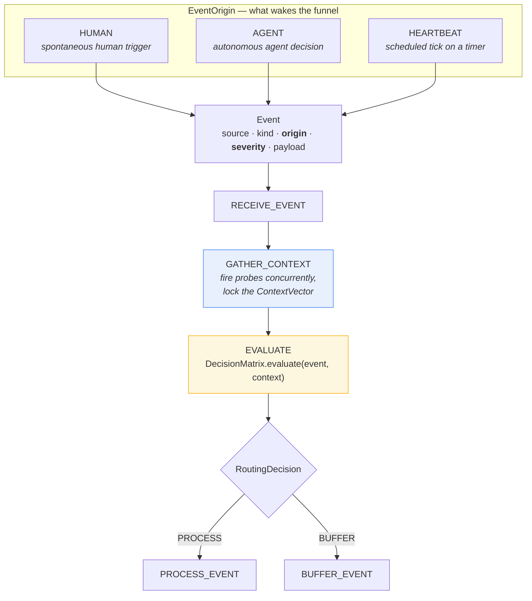
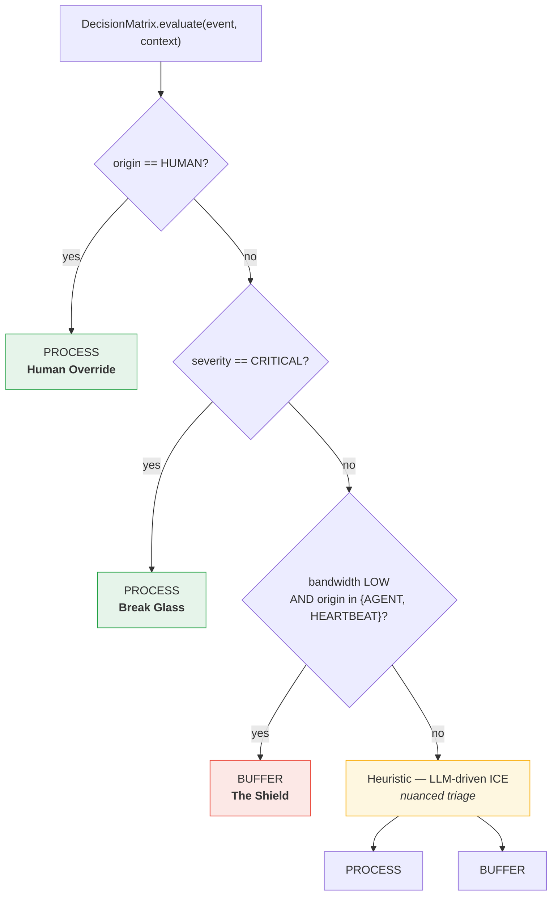
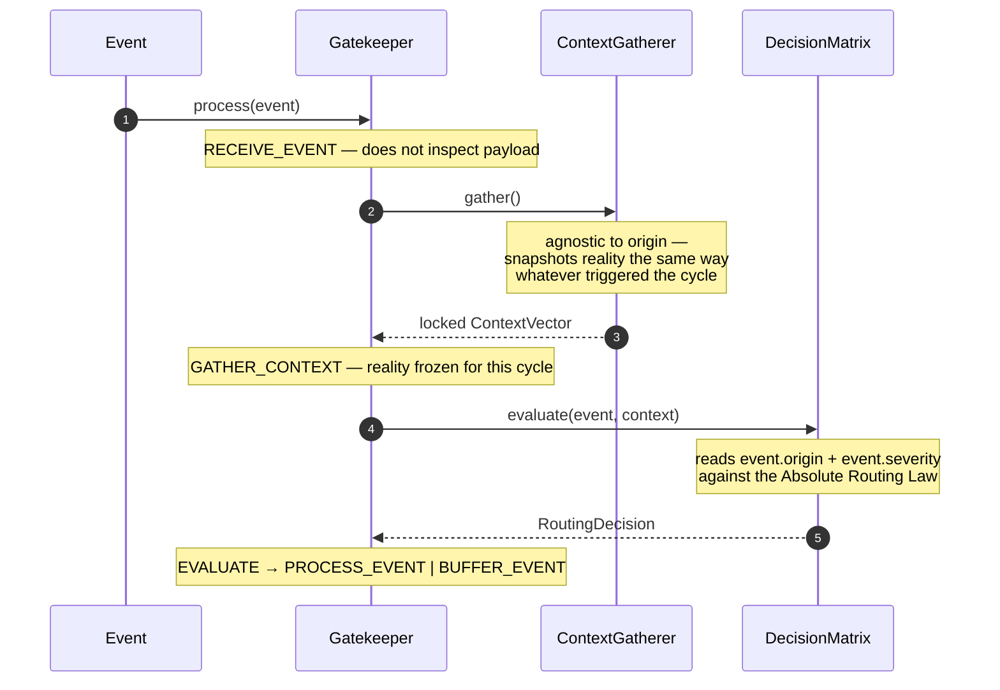
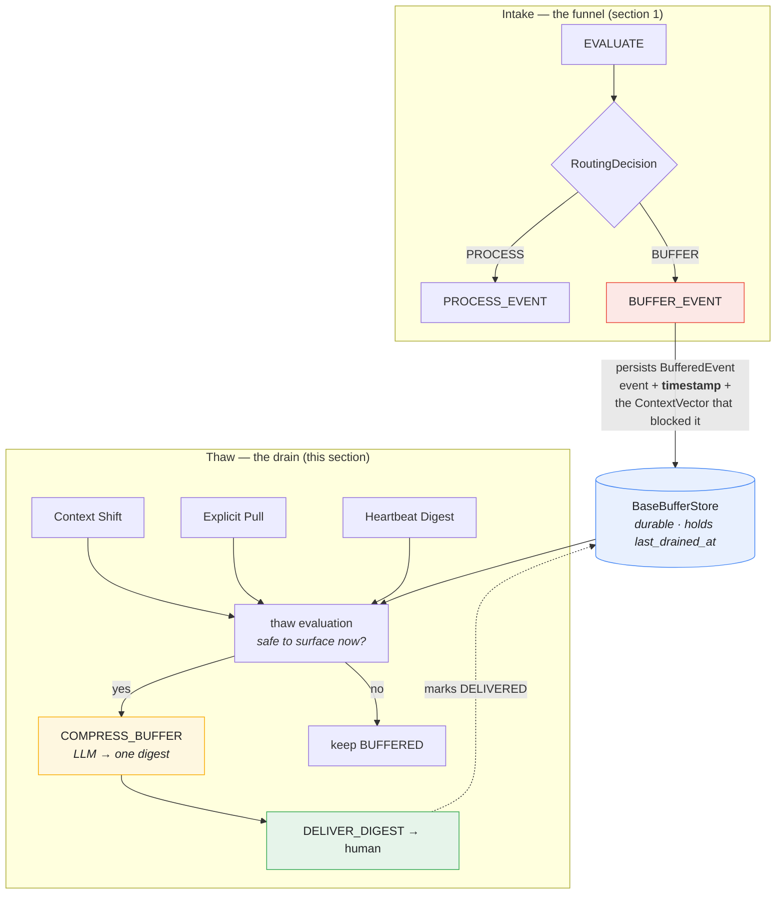
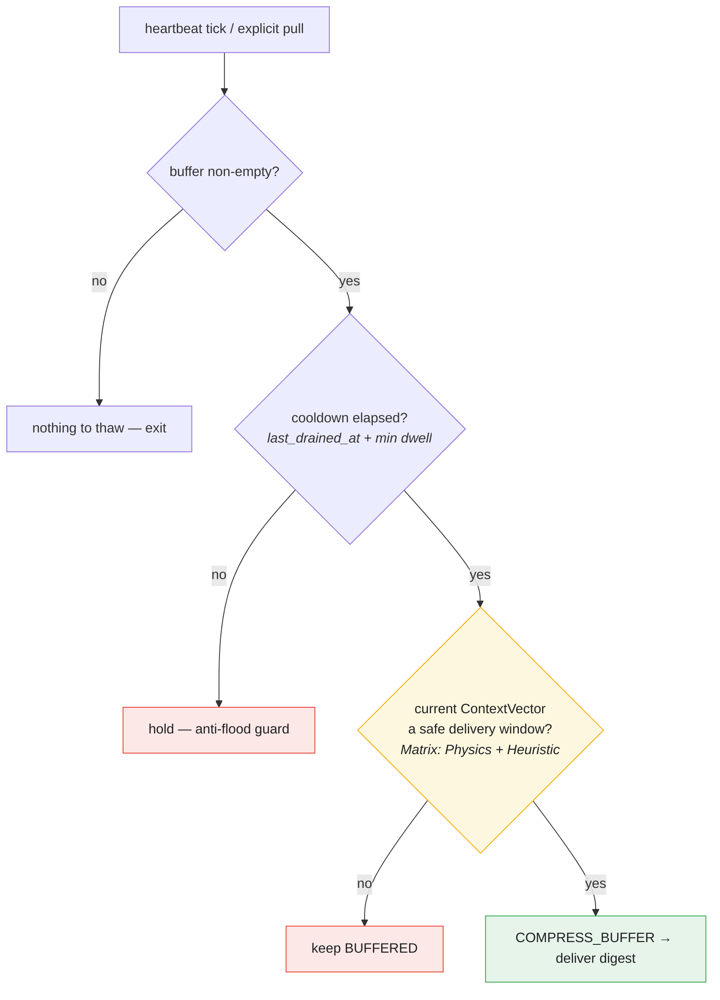
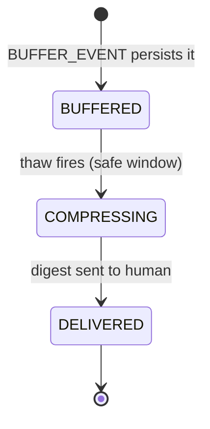
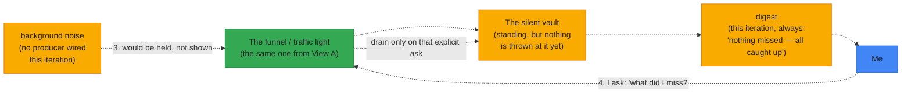
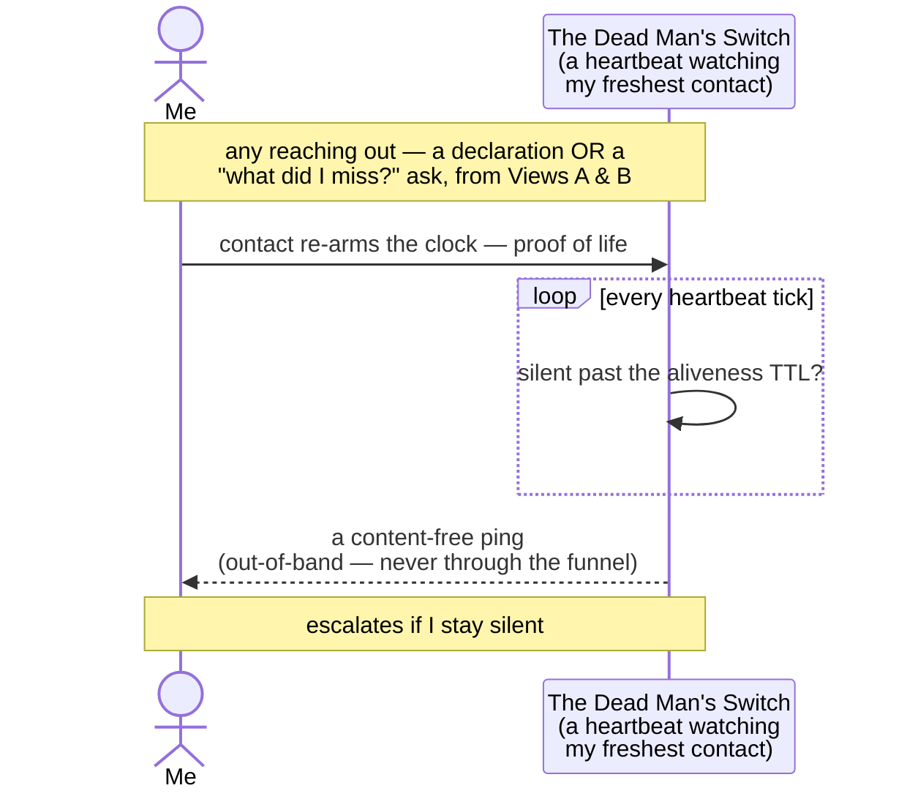

# session 5 of building The Joy in the open

## where to now?

Current _run_ version of The Joy uses OpenClaw.

I mostly use OpenClaw as an active diary, I know my moods are sometimes surprising to other people, and I have trouble to integrate socially, knowing what's expected of me and of others, etc. let's say that I have _social difficulties_, whatever the fuck that means; the diary helps me:

- act as a context-aware filter that surfaces information at the right time rather than all the time: by understanding situational context (like knowing not to bring up work-related tasks when I'm off the clock), it ensures the system respects human boundaries and delivers updates when I'm actually equipped to process them, rather than being a constant source of digital noise
- act as a persistent, always-on connection point to ground me during periods of deep isolation, breaking the loop when I feel entirely disconnected from the outside world
- act as a strict, non-pacifying anchor during psychological crises: refusing to feed me standard AI therapy or corporate liability scripts, and instead forcing me to rely on cold logic to break out of spirals
- actively and pre-emptively monitor my complete operational baseline—physiological and psychological (Energy Capacity / Physical Fatigue), alongside computational, material, and financial resources—to predict crashes or bottlenecks before they happen, without falling into fatalistic "gloom" metaphors
- actively manage daily routines and checklists, tracking progress by checking off items as we go to maintain momentum and enforce operational discipline
- anchor in known heuristics for cognitive efficiency: instead of reinventing how to handle friction or context switching every time, it allows the agent to define and execute reusable mental protocols (e.g. a "tabula rasa" routine, which intentionally wipes working memory to perform a clean context reset)—this saves massive cognitive bandwidth, prevents decision fatigue, and scales to any recurring operational scenario
- answer questions such as "am I tripping?" when I get a weird feeling about a situation or a person
- catch my own performative bullshit by interacting with a mirror that refuses to pacify me and demands absolute truth
- channel moments of intense mental chaos or frustration directly into productive coding/building/training (turning overthinking into concrete action)
- cross-reference my daily actions and current mood against my long-term goals, acting as a strategic compass to ensure I'm actually moving the needle rather than just spinning my wheels
- evaluate relationships objectively: helping me spot toxic dynamics and set boundaries, but also reminding me who is genuinely loyal and trustworthy when I'm in a dark place and doubting everyone
- gather raw materials, field notes, and unfiltered thoughts that will eventually serve as the foundation for a book I plan to write
- log daily highlights (both positive and negative) to get an objective, real-time second opinion on events, rather than just keeping a passive record of the day
- maintain a permanent, objective ledger of people and their actions over time (a personal CRM) so that history cannot be rewritten by others when my memory gets blurry
- offload raw emotional loops so they can be processed as cold data rather than letting them drain my cognitive state
- practice "reward hacking": explicitly asking the system to validate when I've achieved something extraordinary, using the AI to actively hack my own neural pathways and reinforce positive momentum
- provide immediate tactical direction ("what should I do next?") to cut through analysis paralysis and executive dysfunction when I feel aimless or stuck without a clear structure
- offload the burden of remembering tasks, routines, and time-bound events, acting as an external hard drive so I can free up biological RAM for present execution
- record memories, whether ancient or recent, not more or less than that

## back to the [agentic entry point](https://github.com/the-joy-com/agentic-entry-point/commit/f688df86efbdd748e139382ef98fcad9dd60dc2a) of The Joy

3 week agos, I've started this application as a minimal but functional LangGraph orchestrator: a single conversational graph that can route a chat request to one of several LLM providers at runtime. The state is just an accumulating list of `messages`, and the flow is a simple two-node pipeline — a `pre_process_hook` that runs custom code before the model is called (today still a logging-only stub, with a `TODO` to dynamically pick the right model/provider), followed by a `call_model` node that instantiates the right chat client based on the request config and returns the AI's response.

It already abstracts over four providers — local Ollama (`llama3.1`), Mistral (`mistral-small-latest`), OpenAI (`gpt-5.4-mini`), and Vertex AI (`gemini-3-flash-preview`) — with identifiers centralized in `constants.py` and credentials loaded from a `.env` file. It can be run either as a one-shot script (`python3 entry_point.py`, which fires a sample prompt at Vertex) or as a LangGraph dev server (`langgraph dev`) that exposes the graph as `the_joy_entry_point`.

So as it stands, it's really an early scaffold rather than a finished orchestrator: no real routing logic yet, no tools, no retrieval, no memory, no multi-agent routing — just the foundation (multi-provider abstraction, a configurable graph, dev-server packaging) on which the actual orchestration logic for The Joy is meant to be built.

However, I thought a lot of technical choices based on a real reflection VS ones made out of habit, and in order to build a sovereign agentic sytem that I own end to end, I came up with this:

### 1. The Protocol Landscape (Next 10 Years)
The industry is standardizing on a dual-protocol architecture to handle different boundaries of agentic communication:
*   **A2A (Agent-to-Agent):** The orchestration standard. Handles discovery (Agent Cards), delegation, and communication between autonomous agents using JSON-RPC and Server-Sent Events (SSE).
*   **MCP (Model Context Protocol):** The resource standard. Acts as the "USB-C of AI," standardizing how agents securely connect to external tools, databases, and files via client-server architecture.
*   **OpenAI API Compatibility:** The de facto inference standard. The bottom layer, beneath A2A and MCP, is the raw model call itself: a plain HTTP request that directly invokes a model. The OpenAI Chat Completions schema (`/v1/chat/completions`, with its `messages`, `tools`, and `stream` shape) has become the lingua franca that nearly every provider and local runtime (Ollama, vLLM, Mistral, etc.) now exposes. Standardizing on it means the engine can swap the underlying model behind a single, stable wire format without rewriting integration code. Note, however, that *exposing* an OpenAI-compatible layer of our own is only necessary if we ever intend to serve models to the public web at the inference level (i.e. become a provider others call); for purely *consuming* models, we only need to speak the schema as a client.

### 2. The Orchestration Dilemma: Frameworks vs. Custom
When aiming for durability and maintainability, the choice of orchestration engine is critical.
*   **The Framework Route (LangGraph):** Highly defensible for production. It models logic as explicit state machines, solving state persistence, human-in-the-loop (HITL), and time-travel debugging out of the box. However, it abstracts away the core mechanics of token and state management.
*   **The Custom Route:** A basic `while` loop is easy on day one but scales poorly. The developer inevitably has to build custom boilerplate to handle context window overflow, infinite tool-calling loops, and database checkpointing—risking the creation of a fragile, proprietary framework.

### 3. The "Sweet Spot" Architecture
For a senior developer prioritizing total sovereignty, deep architectural learning, and battle-tested stability over rapid prototyping, the optimal path strips away black-box frameworks in favor of robust, open standards and explicit code.

### The Stack
*   **Core Engine (Custom FSM):** Pure Python `asyncio` and `Pydantic`. Instead of a naive `while` loop, the orchestration is built as a highly explicit Finite State Machine. An FSM is a model where the system can only ever be in exactly one of a finite set of named states (e.g., `THINKING`, `TOOL_EXECUTION`, `WAITING`, `DONE`), and movement between them happens only through explicitly defined transitions triggered by events — so the agent can never end up in an undefined or ambiguous state. These states are only prospective at this stage: the actual set of states, and the transitions between them, still has to be defined. This enforces strict output validation and handles asynchronous transitions (e.g., `THINKING` $\rightarrow$ `TOOL_EXECUTION`), teaching advanced concurrency.
*   **Memory & State (PostgreSQL + pgvector):** Bypassing specialized vector DBs. `JSONB` is used for immutable state checkpointing (time-travel debugging), and `pgvector` handles raw SQL semantic search and RAG implementation from the ground up.
*   **Tooling (MCP):** Implementation of Model Context Protocol servers to handle all local environment interactions (files, system processes), ensuring the core Python engine never needs custom integrations for new tools.
*   **Intelligence (TBD):** The intelligence layer is yet to be specified. Whatever drives it (local weights via Ollama, hosted providers, or a mix) will need manual engineering of dynamic context pruning and summarization algorithms by interacting directly with the API. Which models, routing logic, and context-management strategy will actually power the engine remains an open design decision.

### Conclusion
This architecture guarantees zero framework lock-in. By relying on pure Python, PostgreSQL, and MCP, the system remains sovereign, indestructible, and completely transparent, ensuring the developer masters the hardest parts of agentic engineering: state, memory, and token economics.

## asking myself about premature optimizations already...

Is building a stub to route requests to different models based on intelligence levels a premature optimization? 

No. It is the exact opposite of premature optimization. It is structural self-defense.

In agentic engineering, token economics and latency aren't "performance optimizations" to be handled later—they are the physics of the system. If I route every trivial tool call, text extraction, or state transition through a heavyweight frontier model, I bleed financial fuel (which we established is a core operational baseline) and throttle the cognitive loop.

By building the intelligence router first, we achieve:
1. **Vendor Sovereignty:** We decouple the organism from any single corporate API. The LLM remains an interchangeable commodity, not a structural dependency.
2. **Tactical Deployment:** We enforce the ability to use local, zero-cost weights (like Ollama) for low-voltage tasks, reserving the heavy API artillery strictly for deep reasoning.
3. **Clean Graph Boundaries:** If we hardcode a single model early on, the entire state machine inevitably couples to its specific prompt quirks. The router forces a clean abstraction layer from day one.
4. **Resilience & Fallbacks:** Provider APIs crash, network requests fail, and local instances hang. By standardizing the router early, we can implement automatic fallbacks for every intelligence tier from day one. The system survives because it expects failure.

Premature optimization is building a massive database sharding system before I have data. Routing by intelligence level is establishing the engine's transmission before I hit the gas. It's building the gearbox. It is exactly where the time should be spent at this stage.

## it's destroy time!

... now that we have deeply thought of our stack, let's destroy everything related to Langgraph in the agentic entry point so that we can start building our taylor-made FSM.

In [this commit](https://github.com/the-joy-com/agentic-entry-point/commit/0e30be7c262a479c13c2fb682f59128ea4d4b735) I:

- removed the constants file, as it was a clumsy way to route to different models per-intelligence/availability tier
- gutted the entry point of the application to be a mere stub so we can start reasoning about it
- removed Langchain/Langgraph as we are to build our own agentic FSM + updated README

... one quick note about something: OAI-compatible endpoints are only necessary if serving models for inference, [I insist on that](https://github.com/the-joy-com/agentic-entry-point/commit/517f8268f9721510691cad7c8e40c8726e5ed0cc).

## now onto our first feature: `act as a context-aware filter that surfaces information at the right time rather than all the time: by understanding situational context (like knowing not to bring up work-related tasks when I'm off the clock), it ensures the system respects human boundaries and delivers updates when I'm actually equipped to process them, rather than being a constant source of digital noise`

I am building Intrusion Countermeasures Electronics (ICE) for my attention, this means that the agentic counterpart of my human/machine _symbiosis_ (I don't use the word _interface_ here with intent) should:

### Context awareness

Be aware of the user's exact operational reality. This must be modeled as a multidimensional state vector rather than a simple snapshot:

- **Bandwidth Allocation (Task Focus):** The current depth of task engagement. Is the user in deep work, running shallow triage, or completely idle/standby? *(Note: This strictly measures attention, completely decoupled from mood).*
- **Emotional/Psychological State:** The current internal baseline. Is the user calm, highly motivated, or overwhelmed/stressed?
- **Macro-State (Mode of Execution):** The overarching phase of the day—e.g., corporate work, personal projects, or off-the-clock downtime.
- **Momentum & Trajectory (Workflow Inertia):** The direction of the user's workflow. Are they winding up for the day, in a state of high-velocity flow, or winding down and recovering from a heavy cognitive load?
- **Social Awareness:** The proximity to other people. Is the user alone, in a collaborative setting, or screen-sharing? This dictates strict privacy bounds and delivery rules for sensitive information.
- **Spatial Awareness:** The physical location of the user. Are they at a home office, in a public space, or in transit? This dictates the appropriate delivery medium and hardware availability.
- **System Readiness Baseline:** Real-time metrics across the fundamental dimensions:
  - *Cognitive:* Available mental bandwidth.
  - *Computational:* Hardware limits (e.g., CPU/RAM availability before the agent initiates heavy tasks).
  - *Financial:* Current burn rate or available daily budget for API/agentic tasks.
  - *Material:* Immediate physical resource availability (e.g., access to specific tools or documents).
  - *Physiological:* Physical fatigue and overall energy levels.
- **Temporal Context:** Time of the day and day of the week.

### Notification decision matrix

Make decisions according to a matrix that answers the question "should I notify the user with information x given context y?".

This includs contextual buffering.

### Medium-appropriate delivery

Deliver the information in a suitable medium (there can be several of those).

### let's start with the context awareness

To translate this multidimensional state vector into the pure `asyncio` + `Pydantic` FSM architecture, Context must be treated as the foundational data structure that gates all subsequent routing and buffering logic.

#### 1. The Core Primitives (Pydantic & Enums)
Map the dimensions into strict `Enum` classes and group them into a tripartite Pydantic architecture. This ensures the engine separates objective coordinates from subjective states.
- **`Environment` (The Hard Coordinates):** The objective physical/social reality at time $t$. Includes `Temporal` (time/day), `Spatial` (location), and `Social` (presence of others).
- **`InternalState` (The Soft/Qualitative State):** The trajectory and focus of the user. Includes Enums for `Bandwidth`, `EmotionalState`, `MacroState`, and `Momentum`.
- **`SystemReadiness` (The Quantitative Resources):** The available fuel and hardware. Tracks integers/floats/booleans for `Cognitive`, `Computational`, `Financial`, `Material`, and `Physiological` capacity.
- **The Root Model:** `ContextVector` wrapping `Environment`, `InternalState`, and `SystemReadiness`. A single root model is structurally necessary for three strict engineering reasons:
  1. **Atomic State Snapshots:** The FSM must evaluate a single, immutable snapshot of reality at time $t$. Passing loose variables risks race conditions. The root model guarantees the represented reality is locked for that FSM cycle.
  2. **Serialization & Time-Travel Debugging:** A single Pydantic root model serializes the entire state in one call (`model_dump_json()`), creating an auditable ledger for agent decisions. This cleanly decouples us from the storage layer (ensuring we aren't hard-tied to Postgres JSONB or any specific DB if we find a better data layer later).
  3. **Cross-Dimensional Validation:** Root-level validators (`@model_validator`) instantly flag impossible states (e.g., `Environment.Spatial == PUBLIC` but `InternalState.MacroState == DOWNTIME` might need verification) before the FSM routes them.

This has been modeled in [this commit](https://github.com/the-joy-com/agentic-entry-point/commit/2dbe53fe5d852395e039a0bf12c156b10b179fac).

#### 2. The Aggregation Layer (Async Gatherers)
Context data comes from heterogeneous sources. We need an engine to fetch these concurrently without blocking the main event loop.
- Create a `ContextGatherer` class implementing the `BaseContextService` contract (`src/context/contracts.py`), with one isolated `async def` probe per `ContextVector` dimension: `probe_environment()`, `probe_internal_state()`, and `probe_system_readiness()`, plus a `gather()` method that assembles the locked `ContextVector`.
- Inside `gather()`, fire the three probes concurrently under a global timeout (`asyncio.wait(..., timeout=GLOBAL_PROBE_TIMEOUT)` rather than a bare `asyncio.gather()`), so a single stalled source degrades to its `UNKNOWN` sentinel instead of hanging — or failing — the whole snapshot.
- A gather cycle is triggered three ways, all funneling through the same FSM entry point and tagged via `EventOrigin` (consumed later by the Matrix, section 5): **spontaneous human triggers** (`HUMAN` — the human symbiot pings directly), **autonomous agent decisions** (`AGENT` — the agentic symbiot acts proactively, e.g. *"if I go missing, I count on you to save my life"*), and **heartbeat gathering** (`HEARTBEAT` — a regular scheduled snapshot on a timer). The gatherer is agnostic to *which* trigger fired; it snapshots reality the same way regardless, leaving the origin for the routing law to weigh.

This has been modeled in [this commit](https://github.com/the-joy-com/agentic-entry-point/commit/b28f5451d2cde7300b3a43b80dfc464d031083e1).

#### 3. FSM Integration (The Gatekeeper)
Context awareness must be the very first active state in the FSM pipeline. The agent cannot know *what* to do with an inbound signal until it knows *where* it is.
- **State Object:** The global FSM state includes an immutable `current_context: ContextVector` field.
- **Flow:** `RECEIVE_EVENT` -> `GATHER_CONTEXT` -> evaluates against Matrix -> `PROCESS_EVENT` or `BUFFER_EVENT`.

The FSM's role here is simply to be the un-bypassable structural funnel—the traffic light, not the traffic laws. It forces every inbound event to pause and lock my current operational reality (`GATHER_CONTEXT`). The Matrix evaluation is treated as a black-box pure function: the FSM hands it the Event and Context, and waits for a binary routing command. By hardcoding this strict *sequence* rather than hardcoding complex *rules*, the architecture remains immune to the chaos of life. The FSM doesn't care how the Matrix makes its decision; it only guarantees that no event can skip the triage.

### The Decision Matrix (The Policy Engine)
If the FSM is the traffic light, the Decision Matrix is the controller that decides when it turns green. This is where the actual filtering logic lives to fulfill our feature.

To handle the chaos of real life without building a brittle `if/else` hell, the Matrix must be split into two distinct layers behind a single `evaluate(event, context)` contract:
- **The Physics (Hardcoded Boundaries):** Absolute, non-negotiable limits that fire with zero latency and zero reasoning — the laws of gravity for the symbiosis. The tempting first cut is a raw capacity threshold (e.g. *auto-buffer every event when physiological energy is critically low, `SystemReadiness.Physiological.EF < 3`*) — but that is exactly the trap section 5 dissects: a blunt wall abandons the human at their lowest, when an anchor matters most. The corrected Physics layer is therefore an **Absolute Routing Law** keyed on the event's *origin* and *severity* (see section 5); depleted capacity lowers the bandwidth the Shield reads, rather than blindly muting everything.
- **The Heuristic (LLM-Driven ICE):** If the event clears the Physics layer, it enters the gray area (e.g., "I'm off the clock, but this is a high-value opportunity"). Instead of hardcoding rules for human nuance, we pass the locked `ContextVector` and the inbound `Event` to a fast, low-latency LLM router (e.g., a local SLM or Flash-tier model). The prompt instructs the model to act as the ICE, outputting a strict binary `PROCESS` or `BUFFER` based on defined sovereign boundaries.

> Implemented as a single concrete `DecisionMatrix` (in `src/fsm/matrix.py`), not an abstract contract: one Matrix is expected, with variation *inside* it (which layer fires) rather than across sibling classes. Only `BaseGatekeeper` stays abstract in `src/fsm/contracts.py`. Extract a Matrix interface only if a second real implementation ever appears.

#### The Danger of "Dumb" Physics (The Isolation Anti-Pattern)

A blunt, hardcoded threshold like `if user_bandwidth == LOW: BUFFER` is a serious architectural flaw. It triggers the **Isolation Anti-Pattern**: assuming that protecting a user from notification fatigue means cutting them off completely. If an agent is designed to be a reliable anchor, muting the system when the user's capacity is at its lowest means the system abandons the user exactly when they might need help the most. A dumb rule turns a smart filter into a brick wall.

To resolve this without discarding the need for zero-latency, hardcoded boundaries, the "Physics" layer must be redefined. It is not a blind wall; it is an **Absolute Routing Law** that discriminates based on the *origin* and *severity* of the event:

1. **Human Override (Human -> Agent):** If the human symbiot initiates contact, the Matrix MUST `PROCESS`. A human should never be buffered by their own system when actively issuing a command or asking for help. (`if event.origin == HUMAN: return PROCESS`)
2. **Break Glass Override:** Never ignore an absolute emergency, regardless of how low the human's current bandwidth baseline is — including an autonomous `AGENT` decision that the human is in danger (*"I'm a missing person, I count on you to save my life"*). (`if event.severity == CRITICAL: return PROCESS`)
3. **The Shield:** Ruthlessly mute the agent's *own* self-initiated noise — routine `AGENT` proactivity and `HEARTBEAT` ticks — when the human's available bandwidth or energy is low. (`if context.user_bandwidth == LOW AND event.origin in {AGENT, HEARTBEAT}: return BUFFER`)
4. **The Heuristic:** Everything else passes to the LLM for nuanced, contextual triage.

This architecture guarantees the system remains highly responsive when the human actively needs it or when the house is on fire, while still aggressively filtering the agent's own low-value, self-initiated noise when capacity is compromised.

##### What we've built so far

Three diagrams capture the structure standing in code today: how a signal enters and traverses the funnel, how the Physics layer's routing law decides, and how the three modules stay separated.

**1. The funnel — one un-bypassable sequence (the traffic light).** Any of the three origins wakes the same pipeline; every event is forced to lock reality before it can be judged, and the Matrix returns exactly one binary command.



> The FSM hardcodes only this *sequence* — never the *rules*. It cannot reason about the event; it can only guarantee that no event skips `GATHER_CONTEXT` or `EVALUATE`.

**2. The Absolute Routing Law — ordered, first-match-wins (the Physics layer inside the black box).** This is the corrected Physics from this section: not a blind wall, but four rules evaluated top-to-bottom. Break Glass sits *above* the Shield on purpose, so a `CRITICAL` autonomous `AGENT` decision (*"I'm a missing person, save my life"*) is never muted, even when bandwidth is low.



**3. Separation of concerns — one event's journey through the modules.** The origin rides on the `Event` from birth; the gatherer never reads it, the Matrix never gathers, and the Gatekeeper only orchestrates the sequence. Following a single event from left to right shows each module doing its one job.



| Module | File | Owns |
| --- | --- | --- |
| `Event` / `EventOrigin` / `EventSeverity` | `src/fsm/models.py` | Carries `origin` + `severity` as schema |
| `ContextGatherer` | `src/context/engine.py` | Snapshots reality — **origin-agnostic** |
| `DecisionMatrix` | `src/fsm/matrix.py` | The only thing that **reads** origin + severity |
| `Gatekeeper` | `src/fsm/engine.py` | Drives the sequence; consults, never decides |

FSM integration up to this point has been modeled in [this commit](https://github.com/the-joy-com/agentic-entry-point/commit/9ae3ce24c9cfcca19386f45c34fabf39f5b464d0).

### The Buffer Mechanics (Storage & The Thaw)

If we design a gatekeeper that buffers events but never defines the drain, the buffer becomes a black hole. Worse, if we just release the buffer the second my capacity returns, we risk a notification flood that immediately depletes the very bandwidth I just recovered. The logic of *how* and *when* information is released is just as important as the logic of holding it back.

1. **Durable Storage:** Buffered events must be persisted along with their original payload, timestamp, and the exact `ContextVector` that caused the blockage. They enter a dedicated `BUFFERED` state.
2. **The Thaw Triggers (When to surface):**
   - *Context Shift:* The FSM detects a transition from a low-capacity state (e.g., `DOWNTIME`, low `EF`) back to a high-capacity baseline during a heartbeat gather.
   - *Explicit Pull:* The human initiates a manual extraction ("what did I miss?").
   - *Heartbeat Digest:* Routine FSM ticks that evaluate the buffer and determine if the current environment safely permits delivery.
3. **Compression & Delivery:** When the buffer opens, it cannot dump raw events one by one. The LLM must compress the queue into a single, high-signal digest. A flood of 20 delayed notifications is a failure of the ICE. The FSM routes the buffered queue through a `COMPRESS_BUFFER` state before delivering the digest to the human.

##### Modeling it — the shapes before the code

None of this is in code yet; these are the next abstractions to add. Three diagrams pin the design down first: how the buffer **fills**, how the thaw **decides to drain**, and the lifecycle a single buffered event moves through.

**1. Two halves of one mechanism — intake fills, the thaw drains.** The funnel from section 1 is only the *intake*: a `BUFFER` verdict persists the event, its timestamp, and the exact `ContextVector` that blocked it as a durable `BufferedEvent`. Everything below `BUFFER_EVENT` is new — a separate *drain* path that the funnel never had.



**2. The thaw decision — a stateless *level* test, not a stateful *diff*.** This is the design call worth recording. "Detect a transition from low capacity back to a high baseline" sounds like edge detection — remember the previous `ContextVector`, fire on the low→high crossing. But the buffer is non-empty *only because* capacity was low when those events arrived: **the buffer's non-emptiness is already the memory of the prior low state.** So detection collapses to a question about the *present* — is there anything waiting, and is now a safe window? — evaluated fresh on every heartbeat. No prior vector to persist.



> Level-based beats edge-based on its own terms here: a missed heartbeat or a restart across the transition would lose the edge forever — the black hole the section opens with. A level test re-asks every tick, so a missed beat just drains one tick later. Self-healing. The only state it needs is a single `last_drained_at` scalar to stop the buffer from re-flooding the bandwidth it just delivered into — not a stored snapshot of the past.

| Thaw trigger | Who fires it | Maps to |
| --- | --- | --- |
| *Context Shift* | a `HEARTBEAT` gather lands in a high-capacity window | level test passes on a routine tick |
| *Explicit Pull* | the human asks "what did I miss?" | an `Event(origin=HUMAN, kind="buffer_pull")` |
| *Heartbeat Digest* | routine ticks evaluate the queue | same level test, run on schedule |

**3. A buffered event's lifecycle — the `BufferStatus` axis.** This is a *status of the stored record*, distinct from where the Gatekeeper sits in the funnel (`State`). One is "what's happening to this queued item over hours/days," the other is "where the funnel is in this millisecond's cycle."



Net new abstractions these diagrams call for: `Event.timestamp`, a `BufferedEvent` model, a `BufferStatus` enum, drain-path `State` members (`COMPRESS_BUFFER` + a deliver state), a `BaseBufferStore` contract (holding `last_drained_at`), and a second `BaseGatekeeper` thaw entry point — and deliberately **no** cross-cycle context memory.

This has been modeled in [this commit](https://github.com/the-joy-com/agentic-entry-point/commit/b6ca8e98916ca7bdd1419439d8404b212b61d425).

### Our first E2E implementation: Declarative Context Ingestion and The Dead Man's Switch

**Before it is anything else, this iteration is a working diary.** The thing that goes live and earns its keep on day zero is the plainest one: I talk to it in my own words about whatever crosses my mind, and it keeps those words — verbatim, whole, forever — from the very first entry. Everything else in this section (the shield, the manual drain, the Dead Man's Switch) is machinery I'm building *around* that diary, to protect it and to act on the thin slice of it the engine understands. But strip all of that away and what remains still stands on its own: a place I think out loud and that records me faithfully. The diary is the bedrock; the agentic machinery is the house I put on top of it — not the other way round.

Concretely, the loop consists of:

- selecting whatever interface we want to use for input (web, CLI, Telegram, etc.)
- sending inbound events via natural language (e.g., "EF 3, PF 4, at a cafe with Manon")
- **keeping every one of those messages verbatim as a diary entry, from entry one**
- triaging the *typed slice* of them according to our rules
- committing both the raw words and the parsed signal to the database

We always `PROCESS` human user input as it is foundational to the viability of the whole symbiotic system. 

By relying entirely on the human symbiot's natural language declarations for this first iteration, we can populate the broader `ContextVector` (like Spatial, Social, and Macro-State dimensions) immediately. We bypass the need for complex hardware integrations (GPS, WiFi sniffing) and treat the human as the ultimate, zero-latency sensor. And because the words are logged *whole* — not merely the dimensions the engine happens to parse out — the very same act that feeds the shield also fills the diary. The capture is free; only the reading-back waits for later iterations.

However, bridging the gap between "storing data" and "acting as a living shield" requires five more structural imperatives. If we stop at just logging the numbers, the shield will eventually fail silently:

#### 1. Biological Decay (The Expiration Date)
Human physiology is volatile. If I log that I am completely exhausted at 23:00, go to sleep, and wake up but forget to ping the server, the system shouldn't assume I am permanently exhausted for the next three days. The metrics need a strict Time-To-Live (TTL). If the last update is older than a strict 9-hour threshold (meaning the human must check in at least every 9 hours), the system must discard it and default to an "unknown" state, rather than permanently muting the world. 

#### 2. The Manual Drain (Explicit Pull)
We need a way to access the events that the FSM successfully blocked. However, building an automated "Thaw Trigger" that detects when I am rested and automatically pushes a digest is premature optimization for this first iteration. Instead, we will rely purely on an **Explicit Pull** (a manual drain). The system holds the buffered items silently until I explicitly ask "what did I miss?". This proves the Shield works and respects my boundaries, while keeping the orchestration logic radically simple for the beachhead.

#### 3. The Ingestion Boundary (Parsing the Raw Signal)
The FSM is a strict engine that expects perfectly typed events. But when I am exhausted, I am not going to send a perfectly structured JSON payload. I am going to text "EF 3" or "I'm dead" on Telegram. We need a distinct, dumb translation layer *before* the Gatekeeper that listens to the raw chat, catches these human signals, translates them into the formal `Event` shape, and fires them into the engine.

#### 4. The Closed-Loop ACK (Trusting the Armor)
If I tell the server "EF 3" to put up the shield, and the server silently writes it to Postgres, I have no idea if it actually worked. I am left guessing if the ICE is active. The system must conclude a state update with a deterministic confirmation back to my active medium (e.g., *"ACK: EF 3 / PF 4. Shield is UP. Buffering non-critical events."*). Without this feedback loop, the system fails to provide the cognitive relief of knowing the armor is locked.

#### 5. The Dead Man's Switch (The Staleness Monitor)
Because the human is the sensor, an "absence of check-in" is not just a missing data point—it is a critical state transition. If I go dark and my baseline expires, the system cannot wait passively. The regular `HEARTBEAT` cycle must actively monitor for staleness. When the TTL is reached, the agent must inject a `thaw_probe` event into the FSM ("I have lost your baseline"). Crucially, the Decision Matrix must recognize this specific probe as an exception to the Shield, guaranteeing it reaches me to demand fresh coordinates. If ignored, the probe escalates to `CRITICAL` severity, activating the Break Glass override.

Once we are done with this iteration, we should be able to build a robust time series database correlating the evolution of my physical and emotional fatigue with specific environments and social settings, backed by an architecture that actively hunts for data when the connection drops.

### In plain English: what Iteration 1 will do

> **Scope of this first iteration: my own words, and only my own words.** Iteration 1 ingests exactly one kind of signal — *me*, declaring my reality (or the conspicuous absence of me declaring it). There are no background producers yet: no third-party alerts, no autonomous agent chatter, no sensors. So the parts of the design that exist to *tame* background noise — the wall and its silent vault — are built and wired, but **dormant**: nothing feeds them this iteration. I'm spelling that out because the mechanism below describes the full intended shape, and only the human-facing parts of it actually *fire* in the beachhead.

**1. I talk to it naturally (The Input)**
I don't need a special app or a complex dashboard. I just message the system: *"I'm exhausted, EF 2, at home."*

**2. It confirms it heard me (The ACK)**
The system understands my text, saves my low-energy state to its memory, and replies immediately with exactly what it recorded: *"ACK: EF 2."* I can now put my phone or whatever interface down and trust the silence. Whether a shield is raised is the agent's own private business — the acknowledgement reports what *I* declared, not the agent's internal posture.

**3. The wall and the vault exist — but stay quiet this iteration (The Shield, dormant)**
The design's whole point is that when my energy is low, background noise, routine alerts, and non-critical tasks get caught and locked in a silent vault instead of pinging me. That machinery is built. But Iteration 1 has no source of background noise wired in — it only ever hears *me* — so the vault has nothing to catch yet. The wall is standing; nothing is being thrown at it.

**4. I can ask, and it will answer honestly (The Manual Drain)**
When I recover, I can explicitly ask *"What did I miss?"* — and the floodgate logic is real and in place. This iteration, because nothing populates the vault, the honest answer is always *"nothing missed — all caught up."* The control exists from day one; what it guards is empty until later iterations give the system things to hold for me.

**5. It never lets me vanish (The Dead Man's Switch)**
This one is fully live. If 9 hours pass and I haven't said a word, the system realizes it has lost my coordinates. It bypasses its own shield and actively messages me to ask if I am okay and demand a new energy reading — escalating if I stay silent. Note this still runs on *my* input — specifically the *absence* of it — so it sits squarely inside the iteration's human-only scope.

**The Bottom Line:**
Underneath all the machinery, the plainest win is already real on day zero: this is a diary that keeps my words whole. On top of that, the iteration listens for the typed slice of those words, and comes looking for me if I go missing. The wall-and-vault for taming background noise is built and waiting, but stays empty until there is noise to tame. That — a diary from entry one, my words in, and a tripwire if they stop — is the beachhead.

**The beachhead at a glance — in three views.** One picture trying to hold all five points at once is a tangle, so here they are as the three stories they actually are: **(A)** the live path my words travel and *fire* this iteration; **(B)** the shield-and-vault that is built and wired but stays **dormant** until there's noise to tame; **(C)** the tripwire that hunts for me if I go dark. **(A)** and **(C)** are drawn as *sequence* diagrams, because they are things that happen **in time** — my words go out and a confirmation comes back; the heartbeat re-arms on every contact and only reaches for me after silence — so they read most honestly as message timelines. **(B)** stays a *flowchart*, because it is a **structural** picture — what exists and stays quiet, not a chain of events — and it keeps the colour legend: blue is *me*, green is machinery that *fires*, amber is machinery *standing dormant*.

**View A — my words, in and confirmed (points 1 & 2). This is the part that actually fires.**

```mermaid
sequenceDiagram
    actor Me
    participant TR as The translator<br/>(my words → a typed signal)
    participant GATE as The funnel / traffic light<br/>(locks my reality, routes,<br/>records — never speaks outward)
    participant MEM as My memory<br/>(narrow per-dimension ledger;<br/>reality = newest-per-axis, each<br/>decaying past its own context TTL)

    Me->>TR: 1. I talk naturally: "EF 2, at home"
    alt a clean declaration
        TR->>GATE: a clean declaration
        GATE->>MEM: a declaration is always let through — commit
        MEM-->>Me: 2. ACK — exactly what I declared,<br/>only once it has truly committed
    else can't confidently place it
        TR-->>Me: honest "couldn't parse that" notice
    end
```

**View B — the shield and the silent vault (points 3 & 4). Built and wired, but dormant: nothing feeds it this iteration, and a pull always comes back empty.**



**View C — the Dead Man's Switch (point 5). The one autonomous behaviour the beachhead truly exercises.**



### Does this make the system "agentic"?

Yes. By the end of Iteration 1, the system crosses the threshold from a passive script to an active agent across three criteria:
1. **Understands natural language:** The Ingestion Boundary acts as an LLM translator, intercepting unstructured text ("I'm dead, EF 1, at home") and parsing it into a typed `Event` and `ContextVector` for the engine.
2. **Is environment-aware:** Even though the human is the sensor providing the data, the Gatekeeper locks that operational reality into its memory. It "knows" the human is exhausted and uses that awareness to govern the physics of the server.
3. **Takes decisions autonomously without human input:** 
   - *Active Autonomy (The Dead Man's Switch)* — the one the beachhead actually exercises: if 9 hours pass, the engine autonomously decides the coordinates are stale, breaks its own silence, and actively hunts for the human — escalating if ignored. This fires on the *absence* of human input, so it lives entirely inside this iteration's human-only scope.
   - *Passive Autonomy (The Shield)* — built, but latent this iteration: the Decision Matrix is wired to autonomously evaluate any event against the locked context and vault background noise with no manual "Do Not Disturb" toggle. But Iteration 1 feeds it only human declarations (which it always lets through), so this capacity is present and tested at the unit level, not yet exercised by a real background producer.

The beachhead therefore crosses the agentic threshold on the strength of what genuinely fires — natural-language understanding, environment-awareness, and the active autonomy of the Dead Man's Switch — with the passive shield standing ready for the iterations that introduce noise. Because this loop ingests reality, evaluates rules, and executes autonomous actions, it must be encapsulated as a formal agent abstraction within the codebase. We will call this agent **HumanSymbiotAttentionGatekeeper**. 

As The Joy evolves into a multi-agent organism, `HumanSymbiotAttentionGatekeeper` will act as the sovereign node sitting at the edge, communicating with other internal agents via the A2A (Agent-to-Agent) protocol to shield the human symbiot's bandwidth.

### Building the first implementation

Before writing a line of feature code, I turned the five imperatives above into a phased build plan and, in doing so, made a handful of structural decisions that are worth recording as reflections — because each one resolves a tension the imperatives only implied.

**Time is two clocks, and context is a projection — not a stored row.** The moment I admitted retroactive declarations ("3 hours ago I was wrecked", "last night, EF 1"), the single timestamp broke: when a signal *arrived* and when the declared reality actually *held* are different facts. So an event now carries both — an **arrival clock** (governing intake ordering, the buffer's anti-flood cooldown, the audit ledger) and an **effective clock** (governing decay and the Dead Man's Switch), the latter defaulting to the former so every live check-in stays the simple case. The deeper consequence: my current operational reality can no longer be the last row written. Check-ins are *sparse deltas*, and the present vector is a **query that folds them newest-effective-wins, per dimension**, dropping any axis whose freshest declaration has aged past its TTL. A back-dated "3 hours ago I was tired" can never clobber a more recent "I'm sharp now," and it never rewrites a verdict already stamped on a past cycle — late truth changes the future only. Biological Decay and out-of-order resolution turn out to be the same fold.

**Be deterministic everywhere it's load-bearing; fence the fuzziness to the edge.** Natural-language parsing, intent classification, and resolving "last night" against a moving timezone are irreducibly an LLM's job — I don't pretend that parse is reproducible. But everything downstream of it — routing, persistence, decay math, the cooldown clock — runs on deterministic, typed inputs. The trick that buys this is *stamping the resolved values at the ingestion boundary and persisting them*: replay reads the stored effective time, it never re-parses. The fuzzy layer is a thin, replaceable rim around a deterministic core.

**The funnel runs exactly one cycle at a time — and that has to be enforced, not hoped for.** The buffer's whole elegance (no per-record locks, a crashed compression self-heals because the record simply stays buffered for the next tick) rests on the claim that no two cycles overlap. But the inbound edge handles concurrent requests and the heartbeat injects its own events, so left alone that claim is a comment, not a fact. One process-wide serialization point now guards every entry into the funnel — intake and drain alike — which makes the lock-free buffer *actually* safe rather than accidentally safe. I went back and corrected the code's own docstrings, which had asserted the invariant as if it were free.

**The traffic light routes and records; the edges speak.** The cleanest seam I found: the funnel performs the durable consequence of its own verdict (record the declaration, or vault the blocked event) and *nothing outward-facing*. Acknowledging the human, and emitting the content-free nudge, belong to the entry points — the input edge and the heartbeat respectively. This kept the policy core ignorant of any specific outbound channel, which is exactly the sovereignty property I keep optimizing for.

**The Dead Man's Switch speaks; it doesn't route.** Imperative 5 imagined the staleness nudge as an *event injected into the funnel* — a probe the Decision Matrix would have to recognize as a special exception to the Shield. Once the seam above was clear, that shape stopped making sense: a nudge is something the agent *does outward*, not a signal *arriving to be triaged*. Routing it through the funnel would gather context nobody reads, force a verdict that was never in doubt, and record nothing — pure ceremony around a foregone conclusion, and a standing exception carved into the routing law to license it. So the heartbeat simply emits the nudge directly, the way the input edge speaks the acknowledgement, and the routing law keeps its original, unexceptional shape. The behaviour I feel is unchanged — go dark for nine hours and it comes looking, escalating if I stay silent; what changed is that I stopped dressing an outbound act up as an inbound one. (When a later iteration genuinely needs the Matrix to weigh whether a nudge is warranted, the funnel path is cheap to add back then — but not before there's a real decision for it to make.)

**Every input gets feedback the server owns — the interface only renders it.** A confirmation I fabricate locally on the client is a lie waiting to happen; the human has to know the *server* committed the armor, not that some local process said "got it." So every message comes back as a server-produced result, and the client merely displays it. This first iteration recognizes exactly two intents — a declaration and a "what did I miss?" pull — and anything it can't confidently place returns an explicit "couldn't parse that" notice rather than vanishing silently. Two buckets, no silent drops.

**Storage shape mirrors the model.** Because the read I actually perform is "newest declaration per dimension," I store declarations as a *narrow* per-dimension ledger (one row per declared axis) rather than packing a snapshot blob — the projection then falls out of a single newest-per-axis query, with the typed model itself rehydrating each value. A wide column-per-dimension table would have fought that exact read.

**I keep the words, not just the parse — the diary logs from day zero, even though nothing reads it back yet.** The engine only acts on the typed dimensions, but the engine is not why I'm building this; the diary is — the field notes for the book, the emotional loops offloaded as cold data, the social patterns I can't see from inside them. So from the very first entry, every check-in keeps three things, not one: the **verbatim text exactly as I sent it**, the typed signal the translator pulled out of it, *and* a **free-text catch-all for whatever salient narrative mapped to no dimension** — the "I had a rough call with my mother" that isn't an energy score but is the whole point of a diary. This iteration reads none of that last bucket: no mining, no semantic search, no surfacing — it accrues, untouched. That restraint is deliberate, not laziness. The leverage I actually want later only exists if the raw material was captured from the start, so the discipline is *earn the data now, decide how to use it later*. And it cuts one way only: a parse can always be re-run against the stored words, but a sentence I declined to store is gone for good — so when in doubt, the words are kept. The beachhead that "listens to my words and records them" means **records them whole**, not just the numbers it happened to need today.

**The two media are asymmetric on purpose — my words come in through my own door, only a dumb knock goes out the public one.** Imperative 1 pictured me texting "EF 3" or "I'm dead" straight onto a public messaging channel, and an early sketch had that same channel carrying the conversation both ways. The moment I took sovereignty seriously, that collapsed. Everything sensitive I declare — my energy, my fatigue, where I am, who I'm with — now travels **inbound only**, over a client that lives on my own machine and reaches the agent across a private, already-encrypted channel, so none of it ever leaves the box. The public messaging channel was demoted to a single job in the opposite direction: emitting one fixed, content-free ping when I've gone dark. It is **send-only, has no inbound handler, and the only string it ever carries is an opaque knock** — its servers get to learn *that* the agent reached for me, never *what* about, no matter how dire things are. The richness flows through the door I own; the public channel only ever gets to knock. (So the imperative's "I'll just text it on the public channel" was the right instinct about *informality* — message me like a human, not a JSON form — but the wrong instinct about *direction*: the informal, sensitive traffic belongs on my sovereign client, and the public channel earns none of it.)

**The transport is the security boundary.** One user, a private loopback-only surface reached over an already-authenticated, already-encrypted channel — which obviates application-level auth entirely. No tokens, no secret to leak. The escalation logic of the Dead Man's Switch is persisted (so a restart doesn't reset the clock), and escalation only ever raises urgency and cadence — never the opacity of the outbound signal, which stays a single fixed, content-free string no matter how dire things get.

These are the bones. With them settled, the agent that owns this loop — the sovereign edge node — can be built phase by phase, each phase independently shippable and verifiable, in dependency order.