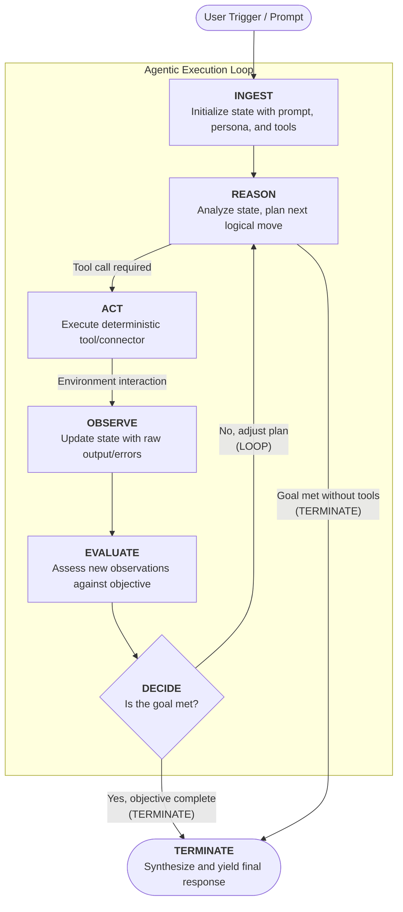

# session 6 of building The Joy in the open

## reflections on what an agent is

I often repeat that, because I like it => an _agentic_ application is an application that:

- can take decisions in an _autonomous_  way(without user input => authority to evaluate its current state and execute a transition without waiting for human approval)
- can understand non pre formatted dynamic inputs which shapes are not known in advance (such as natural language)
- is environment-aware via connectors to external systems

### why a loop earns autonomy (when the goal is open-ended)

When the goal is open-ended — i.e., when the number of steps it takes to get there isn't knowable up front — a cyclical architecture is what lets the system:

- Observe and react to dynamic shifts in the external environment.
- Execute multi-step reasoning to achieve complex goals.
- Self-correct by processing errors from API or tool failures.
- Safely manage the LLM's non-deterministic control flow.

None of this makes the loop a precondition for _being_ an agent — that's the three properties we mentioned (autonomy, natural-language understanding, environment-awareness) that qualify an agent. The loop is the control structure those properties reach for when the step count is unknown; when it's known to be one, an agent runs a single pass and stops (see "but not every agent is a loop" below).

**TL;DR: acyclical does not mean _not agentic_**.

## **The Universal Agentic Lifecycle (the open-ended case):** 

Such an agent operates as a state transition machine, progressing through a continuous cognitive and operational cycle:

1. **INGEST:** Initialize the state (user prompt, system persona, available tools).
2. **REASON:** Analyze the current state and determine the next logical action.
3. **ACT:** Hand execution over to deterministic connectors/tools.
4. **OBSERVE:** Capture environmental feedback (data, errors) and update the state.
5. **EVALUATE:** Assess the new observations against the primary objective.
6. **DECIDE:** A routing node that determines whether to **LOOP** (adjust plan and act again) or **TERMINATE** (goal met, yield final response).

> Note the two arrows into `TERMINATE`. The first comes from `DECIDE`: the agent has gone through the loop at least once, acted, observed, and judged the goal
> met. 
> The second comes straight from `REASON` — the agent decided no tool call was needed and answered in a single pass, never entering the loop at all.
>
> That second edge matters: it shows the diagram already covers the case of an agent that terminates without iterating (zero loop rounds). 
> In other words, the "loop" is not mandatory for every agent — some objectives are settled in one reasoning step. 
> We unpack that distinction below.

### but not every agent is a loop

The lifecycle above is the _iterative_ case, and it's worth being honest that the "MUST" is conditional, not universal. 
The agentic loop is mandatory **when the goal is open-ended** — when you can't know up front how many ACT/OBSERVE rounds it takes to get there, because each observation can change the plan. This will be an excellent criteria of selection of the best pattern when we'll get to build our own agentic platform.

Researching a question, debugging, negotiating a multi-step API dance: these genuinely need the cycle, because the number of steps is itself unknown until you're done.

But plenty of useful agentic work is **single-pass** — one reasoning step, maybe one tool call, then a terminal answer. 
The diagram already concedes this: the `REASON → TERMINATE (goal met without tools)` edge _is_ the zero-iteration case.

In our Joy system, a check-in is exactly that: _parse the free text, route it through the funnel, emit the ACK_. There is no second round to plan, nothing to observe and react to.
Wrapping it in a six-stage iterate-until-done loop would add a DECIDE node that can only ever answer "yes, done" on the first pass — pure ceremony, more surface area to get wrong, zero payoff.

So the sharper claim is this: **the loop is the control structure an agent runs when it has an open-ended, tool-using objective — not a universal stamp on everything we call an "agent."** What makes something agentic is the three properties at the top of this session (autonomy, unstructured input, environment-awareness via connectors); the loop is the structure that _earns_ autonomy when the step count is unknown. When the step count is known to be one, a straight line is the honest shape.

This shapes how we'd build a shared runtime for these agents. If we ever write one common piece of plumbing that all our agents run on, its job is _not_ to make every agent loop. Its job is to make looping safe for the agents that do loop, by enforcing three guarantees:

- **A cap on rounds**, so an agent that gets confused can't keep going forever.
- **Errors turned into data**: when a tool call fails, the failure is recorded as an observation the agent can react to, instead of crashing the whole run.
- **A predictable stopping decision**: the DECIDE step that ends the loop is deterministic, even though the REASON/ACT steps it wraps are not.

A single-pass agent needs none of that safety scaffolding, so we shouldn't force it to carry the weight. The loop is something an agent opts into when its goal actually requires it; the single-pass ones just answer on the first `REASON` and stop, exactly as the diagram allows. We may even design a system where the _decision_ to opt in for a loop-like VS linear flow would be let to a simple LLM call to a top-tier model for instance.